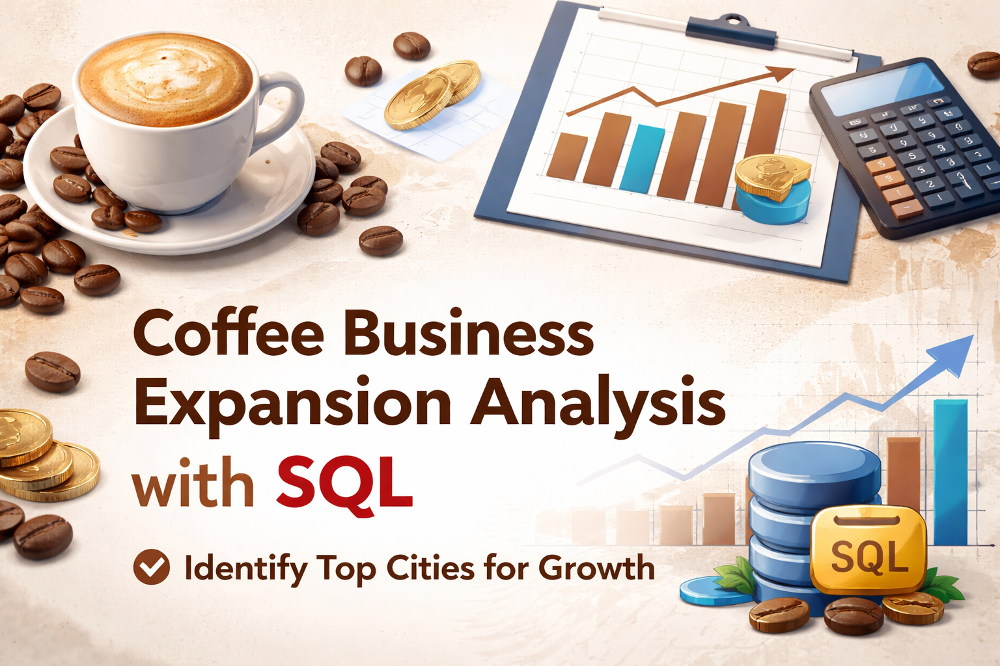

# ☕ Coffee Business Expansion Analysis using SQL

## 📌 Project Overview
This project analyzes sales data of a coffee business to identify the best cities in India for expansion. The analysis focuses on customer behavior, revenue trends, and market potential using SQL.

---

## 🛠️ Tools & Technologies
- SQL
- Relational Database Concepts
- Data Analysis Techniques

---

## 📊 Key Analysis Performed
- Estimated coffee consumers based on population data  
- Calculated total revenue and product-wise sales  
- Identified top-selling products by city  
- Analyzed customer distribution across cities  
- Compared average sales and rent per customer  
- Evaluated monthly sales growth trends  
- Performed market potential analysis for expansion  

---

## 📈 Key Insights
- Pune shows highest revenue with low operational cost  
- Delhi has the largest customer base and market size  
- Jaipur offers strong growth potential with low rent  

---

## 🎯 Final Recommendation
Based on data analysis, the top 3 cities for expansion are:

1. **Pune** – High revenue and low rent  
2. **Delhi** – Large customer base and high demand  
3. **Jaipur** – Cost-efficient with strong sales potential  

---

## 💡 Skills Demonstrated
- SQL (JOIN, GROUP BY, Aggregations)  
- Data Analysis & Business Insights  
- Problem Solving with Real-world Dataset  

---
